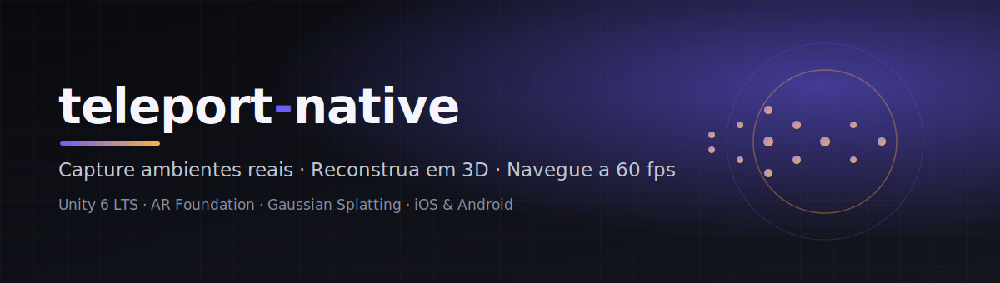

<p align="center"></p>

<h3 align="center">App nativo de captura de ambientes → reconstrução 3D (Gaussian Splatting) → viewer navegável na GPU do celular</h3>
<p align="center">
  <a href="https://unity.com/"></a>
  <a href="#"></a>
  <a href="#"></a>
  <a href="BUILD.md"></a>
</p>

---

> **Conceito:** um corretor/criador escaneia um ambiente real só com o celular (AR) → a nuvem reconstrói em **Gaussian Splatting** → o app navega o espaço em 3D a **60 fps** na própria GPU do aparelho. Inspirado no conceito de *captura simplificada* do Teleport 360 — com **identidade visual e arquitetura próprias**, foco premium e mercado imobiliário (ver [`PRODUCT.md`](PRODUCT.md)).

## ✨ Destaques
- **Captura AR guiada** (ARKit/ARCore) com seleção de keyframes por nitidez/pose, cobertura 360 e detector de desfoque em tempo real.
- **Reconstrução na nuvem** desacoplada (`IReconstructionProvider` — Luma/Worldlabs/Meshy) via backend HomeView reaproveitado.
- **Viewer 3D de splats** com budget adaptativo por dispositivo, anti-termal (thermal throttling) e pacing de FPS com HUD de dev.
- **Design system premium** em código (uGUI): cantos arredondados via SDF→9-slice em runtime, glassmorphism, animações de entrada — dark-first.
- **Clean Architecture** em **8 assemblies** testáveis (lógica pura isolada do Unity).

## 🏗️ Arquitetura
```
Assets/Scripts/
  Core/         domínio, AppFlow (máquina de estados), contratos, DesignTokens, Result<T>
  Performance/  IDeviceProfiler, FramePacer, budget de splats (thermal)
  Capture/      ARCaptureSession, FrameSelector, BlurDetector, CoverageTracker
  Network/      RestClient (Awaitable), HomeViewReconstructionProvider, SplatCache, SceneRepository
  Rendering/    SplatViewerController, SplatCameraController, UnityGaussianSplatAdapter, SplatData
  UI/           UIFactory, componentes, telas, ScreenManager, AppContext/AppBootstrap, UITween
  Editor/       menus de build/cena/CI (SceneBuilder, DeviceBuildMenu, IosCiMenu, ...)
  Tests/EditMode/  lógica pura (AppFlow, FrameSelector, Blur, Coverage, SplatData, ...)
```

## 🚀 Setup rápido
1. **Unity Hub → Add project from disk** → esta pasta (Unity **6000.5.2f1**).
2. Abrir (baixa os pacotes do `manifest.json`: AR Foundation 6 + ARKit/ARCore + UnityGaussianSplatting via git).
3. *Project Settings → XR Plug-in Management*: ative **ARKit** (iOS) e **ARCore** (Android).
4. Menu **Teleport > 4. Montar cena Main (auto)** → cria `Assets/Main.unity` com tudo vinculado.
5. **Teleport > 3. Gerar config.json** e preencha backend/provider/chave (modelo em [`config.example.json`](Assets/Resources/config.example.json)).
6. **M1 (validar 60 fps):** importe um `.ply`/`.splat` de exemplo → atribua ao `SplatViewerController > Editor Splat Asset`.

## 📦 Build & publicação
- Guia completo: [`BUILD.md`](BUILD.md) (cena, XR, loader de splat em runtime, gateway HTTPS, device, lojas).
- Instalar no iPhone pelo Windows (CI gera o `.ipa`, Sideloadly instala): [`IPHONE.md`](IPHONE.md).
- Android direto no device/emulador: menu **Teleport > 5. Build APK (Android)**.
- Pipeline iOS: [`codemagic.yaml`](codemagic.yaml) e [`.github/workflows/ios-ipa.yml`](.github/workflows/ios-ipa.yml).

## 🧪 Testes
Window > General > Test Runner > **EditMode > Run All** (lógica pura).

## 🗺️ Roadmap & visão de produto
O produto evolui para um **SaaS premium de tour virtual imobiliário** (IA, LiDAR/planta, analytics, multi-tenant): veja [`PRODUCT.md`](PRODUCT.md).

## 📄 Docs
[`AGENTS.md`](AGENTS.md) · [`BUILD.md`](BUILD.md) · [`IPHONE.md`](IPHONE.md) · [`PRODUCT.md`](PRODUCT.md)

---

<sub>Identidade visual própria. Nenhuma marca, design ou código de terceiros é copiado — apenas o conceito de captura simplificada.</sub>
